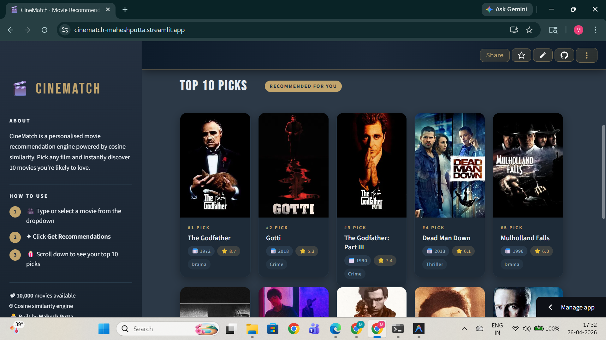

# 🎬 Cinematch

A movie recommendation system built using **Python, Machine Learning, and Streamlit**.

---

## 🚀 Live Demo
👉 https://cinematch-maheshputta.streamlit.app

---

## 📸 Preview

<p align="center">
  
  
</p>

---

## 📌 Features
- Recommend similar movies based on content
- Fast similarity-based suggestions
- Simple and clean user interface
- Built using cosine similarity

---

## 🧠 How it works
This project uses **cosine similarity** on movie metadata (such as genres, keywords, cast, etc.)  
to recommend movies that are most similar to the selected one.

---

## 🛠️ Tech Stack
- Python
- Pandas
- Scikit-learn
- Streamlit

---

## ⚙️ How to Run Locally

```bash
pip install -r requirements.txt
streamlit run app.py